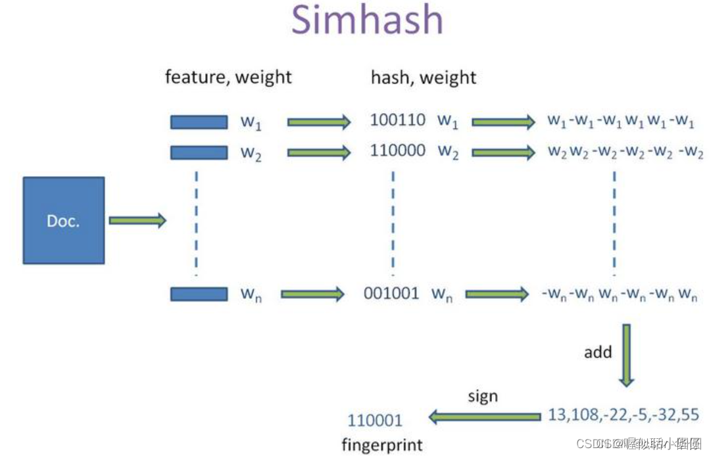
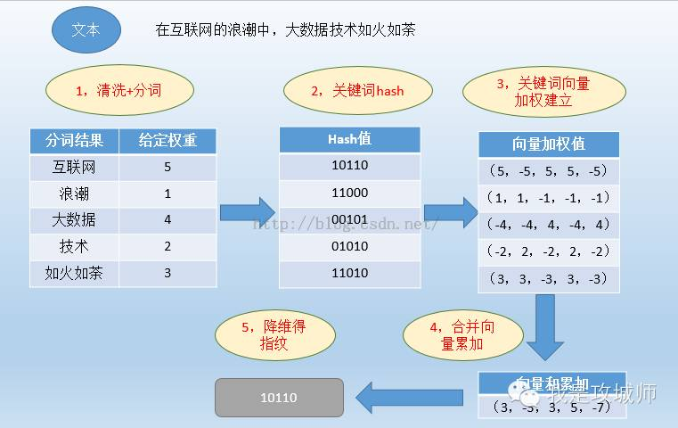
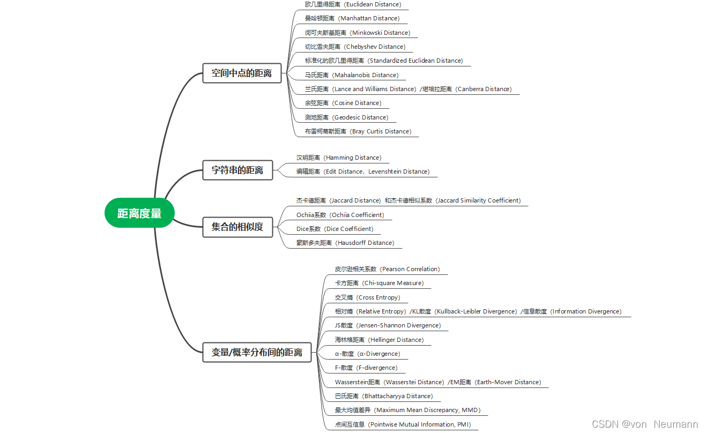

# 文件指纹生成算法

---

## 一、代码中需要生成文件指纹的四种数据类型

在文件指纹生成代码种，我们需要对四种类型的数据进行指纹生成

（str、float、set()、dict())

1. `domain_pred_res`: 领域预测结果，str

2. `domain_pred_match_num`: 领域预测结果的置信度，float

3. `words`: 文件名 / 标题关键词提取结果，set 其中不包括跨领域词

4. `file_key_word` 存储schema和对应schema的结果`dict()`为``string:list` list中为提取出的信息

---

## 二、生成指纹的算法


需求：对于相似的文本生成的Hash值也要相似
### **0、hashlib库**
hashlib是Python标准库中的一个模块，提供了多种最基本的哈希算法，包括MD5、SHA-1、SHA-256等。

```python
import hashlib

# algorithm='md5'/'sha1'/'sha256'
hash_object = hashlib.new(algorithm)
hash_object.update(data)
```

### **0、ssdeep库**
ssdeep 是一种用于计算文件和文本之间相似性的工具，基于 Nilsimsa 算法，可以生成文档的哈希值，用于比对文档的相似性。在 Python 中，可以使用 ssdeep 库进行文档指纹的计算和比对

对比两个文件相似度，python 中可通过`difflib.SequenceMatcher/ssdeep/python\_mmdt/tlsh` 实现，在大量需要对比，且文件较大时，需要更高的效率，可以考虑模糊哈希（fuzzy hash）

PS：直接使用pip install XXX指令在本地环境配置有点问题

> 解决下载安装包，直接安装pip install .\ssdeep-windows-32\_64-master.zip
>
> 安装包在官网可以下下载
>
> 参考：Python 利用模糊哈希实现对比文件相似度详解
>
> https://my.oschina.net/u/3905674/blog/8400953>

```
import ssdeep

ssdeep\_hash = ssdeep.hash(file\_content)
```

### **1、Simhash**

#### 原理

**Simhash**是一种用于文本相似性比较的哈希算法（2007年提出）， google 用来处理海量文本去重的算法，可以将一个文档转换成一个 64 位的字节（特征字）。Simhash可以基于文本内容的特征向量，对相似的文本生成相似的哈希值（具有较好的局部变化容忍性，对于细微差异的文本可以生成相似的指纹）。

**算法步骤**：

1. **分词**：对文本进行分词，提取n个关键词作为表征该文本的特征。(可选步骤：对特征词根据行业领域进行加权）
1. **哈希**：通过hash算法（普通的随意一个即可）将特征词转换为hash值
1. **加权**：分词权重与分词哈希值相乘（具体而言哈希签名为1的位正乘，0的位负乘）
1. **累加**：将各特征词的特征向量累加形成一个序列串
1. **二值化**：将序列串转化为0-1串（也就是向量指纹）（具体来说每一位若>0，转化为1；<0转化为0）
1. **比较**：（相似度计算-汉明距离）

**算法原理图：**



**例子：**



**特点：**

* 局部敏感（local sensitive）

  > 有点像词袋模型，SimHash在计算文本的哈希签名时，通常会对文本中的每个特征（例如，单词）分别进行哈希。相似的文本在某个局部特征上的相似性将导致它们在哈希签名中的某些位上相同。
  

**应用场景：**一般是对**文本大于500+**的内容提前指纹做相似度比较，如果文本较短的话，相似度就会有较大的偏差。（原因：由于汉明距离实际是计算的将一个字符串转换为另一个字符串所需的最小替换次数。如果文本短，一个词改变后，由于该词占的词频比例较大，权重大，影响的最终指纹结果程度大，对结果相似度的影响也很大）

**参考教程**：

[海量数据去重之SimHash算法简介和应用 - 墨天轮 (modb.pro)](https://www.modb.pro/db/115729)

[simhash - 大辉_FFf - 博客园 (cnblogs.com)](https://www.cnblogs.com/do-your-best/p/9846174.html)（包含相似度计算）

[simhash - 码农教程 (manongjc.com)](http://www.manongjc.com/detail/22-ogzpqhxcibhxigw.html)

[(107条消息) 文本相似度计算——Simhash算法（python实现）*simhash文本相似度*Trisyp的博客-CSDN博客](https://blog.csdn.net/Trisyp/article/details/113623966?spm=1001.2101.3001.6650.1&utm_medium=distribute.pc_relevant.none-task-blog-2~default~BlogCommendFromBaidu~Rate-1-113623966-blog-104106867.235%5Ev38%5Epc_relevant_anti_t3_base&depth_1-utm_source=distribute.pc_relevant.none-task-blog-2~default~BlogCommendFromBaidu~Rate-1-113623966-blog-104106867.235%5Ev38%5Epc_relevant_anti_t3_base&utm_relevant_index=2)


---

#### 代码

```python
from simhash import Simhash


def generate_simhash_fingerprint(text):
    simhash = Simhash(text)  # 默认指纹维度64，hash_func默认md5
    # 返回一个十六进制hash指纹
    # return hex(simhash.value)
    # 返回一个Simhash对象（便于之后使用内置函数求语义距离）
    return simhash


def calculate_similarity(simhash1, simhash2):
    distance = simhash1.distance(simhash2)
    similarity = 1 - (distance / 64)  # 假设Simhash的num_perm为64
    return similarity


if __name__ == '__main__':
    str1 = '北京增值税电子普通发票.pdf'
    str2 = '福建增值税电子普通发票.pdf'
    str3 = '福建工程学院计算机学院培养方案.pdf'

    # 生成文件指纹并打印
    fingerprint1 = generate_simhash_fingerprint(str1)
    fingerprint2 = generate_simhash_fingerprint(str2)
    fingerprint3 = generate_simhash_fingerprint(str3)
    print(f"文件指纹1: {bin(fingerprint1.value)}")
    print(f"文件指纹2: {bin(fingerprint2.value)}")
    print(f"文件指纹3: {bin(fingerprint3.value)}")

    # 计算相似度
    similarity_12 = calculate_similarity(fingerprint1, fingerprint2)
    similarity_13 = calculate_similarity(fingerprint1, fingerprint3)
    similarity_23 = calculate_similarity(fingerprint2, fingerprint3)

    print(f"相似度1和2: {similarity_12}")
    print(f"相似度1和3: {similarity_13}")
    print(f"相似度2和3: {similarity_23}")

```

1. **指纹生成**

   使用 `generate_simhash_fingerprint()` 函数生成每个text字符串的 Simhash 指纹

   Simhash算法使用哈希函数将文本的特征转换为一个64位的二进制数，每个位上的值代表了该特征的重要性。该值可通过`.value`得到。同时该类提供了`.distance()`函数方便两个实例计算海明距离，以方便查看和比较。

2. **指纹相似度计算**

   `calculate\_similarity() `函数计算两两之间的相似度

   1. 计算 simhash1 和 simhash2 之间的**汉明距离**，即两个 Simhash 值在二进制形式下不同位的数量。
   2. 将汉明距离除以 Simhash 的长度，假设 Simhash 的长度为 64（num\_perm 的默认值）。
   3. 计算相似度，通过用 1 减去步骤 2 中得到的比值，得到一个相似度值。
   4. 返回相似度值。

   **汉明距离**（Hamming distance）是衡量两个 Simhash 值之间差异程度的度量。在信息论中，两个等长字符串之间的汉明距离是两个字符串对应位置的不同字符的个数。

   > 在这里，相似度是通过汉明距离计算得到的，值越接近 1，表示两个 Simhash 值越相似。因此，返回的相似度值越接近 1，表示两个 Simhash 值越相似。一般情况下，如果相似性大于某个阈值（例如0.8或0.9），我们可以认为两个Simhash值代表的文本或数据在内容上相似，可以视为相同或者具有相似性。
   >
   > 例如下： 10101 和 00110 从第一位开始依次有第一位、第四、第五位不同，则海明距离为 3.
   >
   > 汉明距离是指两个**等长字符串**之间对应位置上不同字符的个数。这种距离计算方法可能并不适用于所有情况，特别是在文本长度差异较大时。可以尝试其他相似度计算方法，例如**余弦相似度**等，看看是否能得到更合理的结果。
   >
   > 谷歌经过工程验证认为当两个64bit的二值化simhash值的汉明距离超过3则认为不相似，所以判重问题就转换为求两个哈希值的汉明距离问题

3. **测试效果：还不错(适合于长文本的str类型数据)**

   ```
   文件指纹1: 0b1010011111110100100000101000010010110101000110100100011010111101
   文件指纹2: 0b1000111111110100100000101000000010110101011110100100011110111110
   文件指纹3: 0x663f036b9eb10ab7
   相似度1和2: 0.875
   相似度1和3: 0.515625
   相似度2和3: 0.484375
   ```


### 2、Minhash

#### 原理

Minhash（最小哈希）是一种用于**集合**相似性比较的哈希算法，可以用于处理文本的相似性（1997年提出）。通过对文本内容进行集合表示，然后使用Minhash算法生成指纹。相似的文本内容会生成相似的Minhash指纹。主要用于计算两个集合的Jaccard相似度，其中Jaccard相似度表示两个集合的交集大小与并集大小的比值。

**算法原理图：**


> 实际中我们不必对矩阵的行真的进行排列运算，而是可以采用hash函数来对行号进行变换，不同的hash函数对应不同的行排列，从而构建一组minhash结果，而这就是该集合的minhash签名（指纹）

**算法步骤：**

1. **分词**： 首先对文件进行分词或处理，将文件拆分成一系列元素（如词语、字符等）。
1. **哈希**：对每个元素进行哈希，得到一个哈希值（相当于为每个元素确定一个行号）。
1. **矩阵化**：构建一个signature matrix（签名矩阵），其中每一列代表一个哈希函数对所有元素的哈希值进行映射（每个元素的原始行号-->hash后的行号）。
1. **Minhash**: 对于每个哈希函数（每一列），找到其对应列中的最小哈希值（也就是新排列中行号最小的元素），这些最小值共同构成一个指纹向量。
1. **相似度计算**：使用Jaccard相似度来比较两个文件的指纹相似度。Jaccard相似度是两个集合的交集大小除以并集大小，用来度量两个集合之间的相似性。

**例子：**

`Min-hashing`定义为：特征矩阵按行进行一个随机的排列后，第一个列值为1的行的行号。举例说明如下，假设之前的特征矩阵按行进行的一个随机排列如下：

|**元素**|**S1**|**S2**|**S3**|**S4**|
| :- | :- | :- | :- | :- |
|他|0|0|1|0|
|成功|0|0|1|1|
|我|1|0|0|0|
|减肥|1|0|1|1|
|要|0|1|0|1|
`　　`最小哈希值：h(S1)=3，h(S2)=5，h(S3)=1，h(S4)=2.

**特点：**

* 局部敏感（local sensitive）

  >  对于两个集合S1,S2来说，我们知道在前面的矩阵的所有行中，他们的值同时为1的行有|S1∩S2|个；一个是1一个是0的行有|S1∪S2|−|S1∩S2|个。那么在对行进行随机排列之后，从上往下数同时为1的行比一个为1一个为0的行先出现的概率就是|S1∩S2|/|S1∪S2|。而这恰巧就是两个集合的Jaccard相似度。
  >
  >  也就是说在每一次最小哈希的过程中，两个集合的minhash相等的概率就是两个集合的Jaccard相似度。这就保证了所有minhash组成的签名之间相等的概率也等于对应集合的Jaccard相似度。因此从集合到minhash签名，相似度被保留了下来。

**应用场景：**适用于大规模数据集合的相似性问题，**适合set数据类型**。Minhash算法是一个近似算法，相似性的计算结果并不是完全精确的

**参考教程**：

[文本内容相似度计算方法：minhash – 标点符 (biaodianfu.com)](https://www.biaodianfu.com/minhash.html)

[最小哈希签名（MinHash）简述-腾讯云开发者社区-腾讯云 (tencent.com)](https://cloud.tencent.com/developer/article/2162118)

[文本去重之MinHash算法 - pathenon - 博客园 (cnblogs.com)](https://www.cnblogs.com/pathenon/archive/2012/07/17/2595778.html)

[minHash最小哈希原理 - stardsd - 博客园 (cnblogs.com)](https://www.cnblogs.com/sddai/p/6110704.html)


---
#### 代码

```python
from datasketch import MinHash, MinHashLSH


def ngrams(text, n=3):
    """
    生成N-gram序列。
    :param text: 要生成N-gram序列的文本。
    :param n: N-gram的大小。
    :return: N-gram序列。
    """
    ngrams = []
    for i in range(len(text) - n + 1):
        ngrams.append(text[i:i + n])
    return set(ngrams)


# 定义函数，用于生成MinHash
def generate_minhash(data, num_perm):
    minhash = MinHash(num_perm=num_perm)
    for item in data:
        # MinHash类的逻辑是提前确定好128个hash映射关系，每新增一个元素，重新算一遍该元素的128种映射结果，再和之前的128个最小值结果去比较，如果小于，则更新该位置的值，否则不更新
        minhash.update(item.encode('utf8'))
    return minhash


# 定义一个函数，用于计算两个文档指纹的Jaccard相似度
def jaccard_similarity(minhash1, minhash2):
    return minhash1.jaccard(minhash2)


# 直接对两个set类型数据计算Jaccard相似度
def jaccard_similarity2(set1, set2):
    intersection = len(set1.intersection(set2))
    union = len(set1.union(set2))
    return intersection / union


# 一个用于在大规模数据中进行快速相似项查询的方法
def minhashLSH_search(minhash_sets, query_set, threshold=0.5, num_perm=128):
    lsh = MinHashLSH(threshold=threshold, num_perm=num_perm)  # threshhold是判定是否相似的jaccard阈值
    for name, set in minhash_sets.items():
        lsh.insert(name, set)
    return lsh.query(query_set)


if __name__ == '__main__':
    # 定义两个示例的set类型数据
    set1 = {'apple', 'banana', 'orange', 'grape'}
    set2 = {'apple', 'watermelon', 'banana', 'kiwi'}
    str3 = '北京增值税电子普通发票.pdf'
    str4 = '福建增值税电子普通发票.pdf'
    str5 = '福建工程学院计算机学院培养方案.pdf'

    # 使用MinHash生成文件指纹
    num_perm = 128  # MinHash的num_perm参数，影响MinHash的精度
    minhash1 = generate_minhash(set1, num_perm)
    minhash2 = generate_minhash(set2, num_perm)
    minhash3 = generate_minhash(ngrams(str3, 1), num_perm)
    minhash4 = generate_minhash(ngrams(str4, 1), num_perm)
    minhash5 = generate_minhash(ngrams(str5, 1), num_perm)

    # 打印哈希值
    print(f"文件指纹1: {minhash1.digest()}")
    print(f"文件指纹2: {minhash2.digest()}")
    print(f"文件指纹3: {minhash3.digest()}")
    print(f"文件指纹4: {minhash4.digest()}")
    print(f"文件指纹5: {minhash5.digest()}")

    # 使用Jaccard相似度计算相似度
    similarity = jaccard_similarity(minhash1, minhash2)
    print("文档指纹Jaccard相似度：", similarity)
    similarity2 = jaccard_similarity2(set1, set2)
    print("文档集合Jaccard相似度：", similarity2)
    similarity34 = jaccard_similarity(minhash3, minhash4)
    print("3和4两个文本的文档指纹Jaccard相似度：", similarity34)
    similarity35 = jaccard_similarity(minhash3, minhash5)
    print("3和5两个文本的文档指纹Jaccard相似度：", similarity35)
    similarity45 = jaccard_similarity(minhash4, minhash5)
    print("4和5两个文本的文档指纹Jaccard相似度：", similarity45)

    # 使用MinHashLSH查询相似项（这一步可以在大规模数据中进行快速相似项查询）
    sets = {"set1": minhash1, "set2": minhash2, "set3": minhash3, "set5": minhash5}
    result = minhashLSH_search(sets, minhash4)
    print("MinHashLSH查询相似项：", result)
```

1. **指纹生成**

   `generate_minhash()`函数：用于生成MinHash。这个函数接受一个字符串类型的集合data和num\_perm参数，其中num\_perm会影响MinHash的精度，它表示生成MinHash时使用的哈希函数数量，默认为128。

2. **指纹相似度计算**

   `jaccard_similarity()`函数，用于计算Jaccard相似度。Jaccard相似度是两个集合的交集大小除以并集大小的比值，用于衡量两个集合的相似程度。

   **Jaccard相似度**是一种度量集合相似性的指标，它衡量两个集合的交集大小与并集大小的比例。对于使用Minhash生成的两个文件指纹，它们可以看作是两个集合，其中包含了一系列的哈希值。

   Jaccard相似度的计算公式如下：

   $$Jaccard相似度 = (两个集合的交集大小) \div (两个集合的并集大小)$$

   Jaccard相似度的取值范围在0到1之间，值越接近1表示两个文件的内容越相似，值越接近0表示两个文件的内容越不相似。

3. **效果：还不错（适合于set类型数据）**

   ```
   文件指纹1: [ 200169630 1298872416  ...]
   文件指纹2: [1851615388  303413502 ...]
   文档指纹Jaccard相似度： 0.328125
   文档集合Jaccard相似度： 0.3333333333333333
   文档集合Jaccard相似度： 0.3333333333333333
   3和4两个文本的文档指纹Jaccard相似度： 0.8046875
   3和5两个文本的文档指纹Jaccard相似度： 0.1484375
   4和5两个文本的文档指纹Jaccard相似度： 0.203125
   MinHashLSH查询相似项： ['set3']
   ```


### 3、Karp-Rabin卡普-拉宾算法(&#x2716;)

#### 原理

Karp-Rabin是一种字符串匹配算法，用于在一个长文本中高效地查找一个短模式的出现位置。该算法是由Michael O. Rabin和Richard M. Karp于1987年提出的。

Karp-Rabin算法的核心思想是通过哈希函数对模式和文本中的子串进行哈希计算，然后比较哈希值来判断是否匹配。它使用了一种滑动窗口的方法，在文本中滑动一个与模式长度相同的窗口，通过哈希函数计算窗口内子串的哈希值，并将其与模式的哈希值进行比较。

具体步骤如下：

1. 计算模式的哈希值和第一个窗口子串的哈希值。

2. 在文本中滑动窗口，每次滑动一个字符，并通过哈希函数计算新窗口子串的哈希值。

3. 将新窗口子串的哈希值与模式的哈希值进行比较，如果相等，则说明找到了一个匹配。

4. 如果哈希值不相等，继续滑动窗口，重复步骤3。

**特点：**

* 只能比较“硬相似度”，没有集合的思想，如果两个文段的相同内容出现在不同位置，该算法会认为二者是完全不同的，而不能像minhash等算法提取出相似性

**应用场景：**主要用于字符串匹配，因此适合处理字符串类型的数据，比如str

**参考教程：**[Rabin–Karp 算法 - 知乎 (zhihu.com)](https://zhuanlan.zhihu.com/p/563551141?utm_id=0)

[Rabin-Karp算法 - 简书 (jianshu.com)](https://www.jianshu.com/p/e20994e5e33c)

[Rabin-Karp算法概述 - ChristianL - 博客园 (cnblogs.com)](https://www.cnblogs.com/christianl/p/13747580.html)

---
#### 代码

```python
import hashlib


def generate_karprabin_fingerprint(text, window_size=5, base=256, prime=101):
    """
    使用Karp-Rabin算法生成文本的指纹（哈希值）。
    :param text: 要生成指纹的文本。
    :param window_size: 滑动窗口的大小。
    :param base: 基数，用于计算哈希值。
    :param prime: 大素数，用于计算哈希值。
    :return: 文本的指纹（哈希值）。
    """
    # 初始化哈希值
    hash_value = 0
    # 存储所有窗口的哈希值
    window_hashes = []

    # 计算窗口内的初始哈希值
    for i in range(window_size):
        hash_value = (hash_value * base + ord(text[i])) % prime
    window_hashes.append(hash_value)

    # 滑动窗口生成哈希值
    for i in range(1, len(text) - window_size + 1):
        # 移除滑动窗口前一个字符的贡献
        hash_value = (hash_value - ord(text[i - 1]) * pow(base, window_size - 1, prime)) % prime
        # 添加滑动窗口后一个字符的贡献
        hash_value = (hash_value * base + ord(text[i + window_size - 1])) % prime
        # 存储当前窗口的哈希值
        window_hashes.append(hash_value)

    # 将所有窗口的哈希值连接起来，作为整个字符串的指纹
    fingerprint = ''.join(str(h) for h in window_hashes)

    return fingerprint


def hamming_distance(hash1, hash2):
    """
    计算两个字符串之间的汉明距离。
    :param hash1: 第一个字符串的哈希值。
    :param hash2: 第二个字符串的哈希值。
    :return: 汉明距离。
    """
    distance = sum(bit1 != bit2 for bit1, bit2 in zip(hash1, hash2))
    return distance


def calculate_similarity(hash1, hash2):
    """
    计算两个字符串之间的相似度。
    :param hash1: 第一个字符串的哈希值。
    :param hash2: 第二个字符串的哈希值。
    :return: 相似度。
    """
    num_bits = len(hash1)
    distance = hamming_distance(hash1, hash2)
    similarity = 1 - (distance / num_bits)
    return similarity


if __name__ == '__main__':
    # str1 = 'This is a test text for similarity calculation using Karp-Rabin algorithm'
    # str2 = 'This is a test text for similarity calculation using Karp-Rabin algorithm and a little long'
    str1 = '北京增值税电子普通发票.pdf'
    str2 = '福建增值税电子普通发票.pdf'
    str3 = '福建工程学院计算机学院培养方案.pdf'

    # 生成示例文本的Karp-Rabin文件指纹
    fingerprint1 = generate_karprabin_fingerprint(str1)
    fingerprint2 = generate_karprabin_fingerprint(str2)
    fingerprint3 = generate_karprabin_fingerprint(str3)

    print("Karp-Rabin文件指纹示例:")
    print("str1:", fingerprint1)
    print("str2:", fingerprint2)
    print("str3:", fingerprint3)

    # 计算相似度
    # similarity = calculate_similarity(fingerprint1, fingerprint2)
    # print(f"相似度: {similarity}")
    similarity_12 = calculate_similarity(fingerprint1, fingerprint2)
    similarity_13 = calculate_similarity(fingerprint1, fingerprint3)
    similarity_23 = calculate_similarity(fingerprint2, fingerprint3)

    print(f"相似度1和2: {similarity_12}")
    print(f"相似度1和3: {similarity_13}")
    print(f"相似度2和3: {similarity_23}")
```

1. **指纹生成**

   `generate_karprabin_hash`函数用于生成文本的指纹。它接受文本字符串作为输入，并使用Karp-Rabin算法计算滑动窗口的哈希值，然后将所有窗口的哈希值连接起来，作为整个字符串的指纹。

2. **指纹相似度计算**

   1. hamming_distance函数用于计算两个字符串之间的汉明距离。它接受两个字符串的哈希值作为输入，并通过逐位比较两个哈希值的不同位数，计算汉明距离。
   2. calculate_similarity函数用于计算两个字符串之间的相似度。它接受两个字符串的哈希值作为输入，并使用汉明距离计算相似度。相似度计算的方法是通过将汉明距离除以哈希值的总位数，得到相似度。

3. **效果：常见的处理方法都具有局限性**
   1. 简单拼接每一个小窗口的hash值，可能会导致最终文档指纹长度不同，无法计算汉明距离
   2. 当两个字符串的相似部分位于不同位置时，Karp-Rabin算法无法判断出这种相似性，因为他们分别位于指纹的不同部分。
   
   ```
   Karp-Rabin文件指纹示例:
   str1: 2778544045329935378749
   str2: 24100544045329935378749
   str3: 43939476678617353876343989
   相似度1和2: 0.13636363636363635
   相似度1和3: 0.18181818181818177
   相似度2和3: 0.08695652173913049
   ```

**优化思路：**

1. 把这种“内容顺序相关”的指纹生成模式转变为“集合式的”，要让不同文档中相同部分位于指纹的同一片区。、
2. 需要想方法统一最终生成的指纹长度
3. 这样想起来其实没啥考虑这种方法的必要了，相比于simhash等方法实在是有点原始。
4. 其实感觉winnowing就是基于karp-rabin思想形成的指纹生成方法


### 4、Winnowing

#### 原理

Winnowing算法是一种用于文本数据的局部散列算法（2003年提出），主要用于文本去重和查找近似重复的文本片段。该算法基于散列函数，可以快速地生成文本的指纹，从而方便地进行文本相似性的计算。Winnowing可以有效地识别重复的文本段落或者检测抄袭文本。

**算法原理：**

基本思想是将文本分成固定大小的滑动窗口，在每个窗口内使用散列函数计算散列值，然后在所有窗口中选择散列值最小的一个作为该位置的指纹。通过这种方式，Winnowing算法可以过滤掉文本中的噪声和不重要的信息，保留重要的特征，从而实现文本去重和相似性计算。

**k-grams+Winnowing算法步骤：**

1. **生成k-grams**：将原始文本切分成连续的k个字符的子串，这些子串被称为k-grams。k-grams是文本的局部特征表示，能够捕捉文本的局部信息。
2. **计算k-grams的哈希值**：对于生成的每个k-gram子串，使用哈希函数将其转换为哈希值。这一步将k-grams映射为哈希值，缩小了指纹的维度。
3. **选取局部最小哈希值**：在生成的哈希值列表中，选择局部最小的哈希值作为该位置的指纹。具体做法是定义一个滑动窗口，在窗口内找到最小的哈希值，并记录下来。随着窗口滑动，不断更新最小值，得到文本的指纹。
4. **连接指纹**：将不同位置的指纹连接起来，形成整个文本的指纹表示。这样，每个文本都会有一串指纹值，代表了文本的局部特征。
5. **存储指纹**：将生成的文本指纹存储起来，用于后续的文本相似度计算和比较。

**应用场景：**k-grams+Winnowing算法主要用于文本相似度计算，特别是对于较长文本的相似度比较。通过局部特征的表示，可以捕捉文本的相似部分，而Winnowing算法的局部最小哈希选择策略能够进一步减少指纹的维度，提高计算效率。这种算法适用于大规模文本相似度比较和查重等应用场景。

**参考教程：**

[(107条消息) 【文本相似性计算】winnowing算法_夜谷子的博客-CSDN博客](https://blog.csdn.net/weixin_43098787/article/details/82837867)

[(107条消息) winnowing 算法 -- 提取文档指纹特征**winnowing算法**ouprince的博客-CSDN博客](https://blog.csdn.net/qq_32023541/article/details/82382808)

[(107条消息) 基于K-gram的winnowing特征提取剽窃查重检测技术（概念篇）**kgramhash**君的名字的博客-CSDN博客](https://blog.csdn.net/chichoxian/article/details/53115067?spm=1001.2101.3001.6650.2&utm_medium=distribute.pc_relevant.none-task-blog-2~default~BlogCommendFromBaidu~Rate-2-53115067-blog-82382808.235^v38^pc_relevant_anti_t3_base&depth_1-utm_source=distribute.pc_relevant.none-task-blog-2~default~BlogCommendFromBaidu~Rate-2-53115067-blog-82382808.235^v38^pc_relevant_anti_t3_base&utm_relevant_index=3)

[基于 Hash 与 Winnowing 方法的文档查重 | nameoverflow (hcyue.me)](https://hcyue.me/2017/05/11/plagiarism-detection/)

**PS1：hash选择和相似度算法选择**

> 1. hash理论上用啥都差别不大？？？？？？待探索
> 2. 由于文档长度不同，其实更适合以集合式的方式来计算，比如选择jaccard相似度。

---
#### 代码

```python
from simhash import Simhash
import hashlib


def generate_kgrams(text, k):
    """
    生成k-grams列表。
    :param text: 要生成k-grams的文本。
    :param k: k-grams的长度。
    :return: k-grams列表。
    """
    kgrams = []
    for i in range(len(text) - k + 1):
        kgram = text[i:i + k]
        kgrams.append(kgram)
    return kgrams


def calculate_hashes(kgrams):
    """
    计算k-grams的哈希值列表。
    :param kgrams: k-grams列表。
    :return: 哈希值列表(10进制)。
    """
    hashes = []
    for kgram in kgrams:
        hash_value = hashlib.sha1(kgram.encode('utf-8'))
        hash_value = hash_value.hexdigest()[-4:]
        hash_value = int(hash_value, 16)  # using last 16 bits of sha-1 digest
        # 也可以换其他hash
        hashes.append(hash_value)
    return hashes


def winnowing(hashes, window_size):
    """
    使用Winnowing算法从哈希列表中生成文本的指纹。
    :param hashes: 哈希值列表。
    :param window_size: 滑动窗口大小。
    :return: 文本的指纹集合(10进制)。
    """
    min_hashes = []
    # 找到初始窗口中的最小哈希值(若有重复选最右边)
    min_pos, min_hash = 0, hashes[0]
    for i, x in enumerate(hashes[0:window_size]):
        if x <= min_hash:
            min_pos, min_hash = i, x
    min_hashes.append(min_hash)

    # 滑动窗口，选择局部最小哈希值
    for i in range(1, len(hashes) - window_size + 1):
        if min_pos < i:
            min_pos, min_hash = i, hashes[i]
            for pos, x in enumerate(hashes[i:window_size + i]):
                if x <= min_hash:
                    min_pos, min_hash = pos + i, x
            min_hashes.append(min_hash)
        elif hashes[i + window_size - 1] <= min_hash:
            min_pos = i + window_size - 1
            min_hash = hashes[i + window_size - 1]
            min_hashes.append(min_hash)

    return min_hashes


def kgrams_winnowing(text, k, window_size):
    """
    使用k-grams+Winnowing算法生成文本的指纹。
    :param text: 要生成指纹的文本。
    :param k: k-grams的长度。
    :param window_size: 滑动窗口大小。
    :return: 文本的指纹(一个list结构，包含选出的多个hash值，10进制int表示)。
    """
    kgrams = generate_kgrams(text, k)
    hashes = calculate_hashes(kgrams)
    fingerprints = winnowing(hashes, window_size)
    return fingerprints


# def calculate_hamming_similarity(fingerprints1, fingerprints2):
#     """
#     计算两个文本指纹之间的汉明距离相似度（基于思想略做修改——原始汉明距离是算01串的差别，但是winnowing算法得到的值其实每一个小部分的十进制哈希和
#     其它算法得到的一个位的01值维度差不多，所以直接计算每个十进制相同与否就好）。
#     （其实感觉winnowing得到的hash好像不太适合用汉明距离算）
#     :param fingerprints1: 第一个文本的指纹（16进制）。
#     :param fingerprints2: 第二个文本的指纹（16进制）。
#     :return: 相似度。
#     """
#     # 填充两个指纹为一样长
#     if len(fingerprints1) > len(fingerprints2):
#         fingerprints2.extend([0] * (len(fingerprints1) - len(fingerprints2)))
#     elif len(fingerprints1) < len(fingerprints2):
#         fingerprints1.extend([0] * (len(fingerprints2) - len(fingerprints1)))
#     # 计算汉明距离
#     distance = sum(bit1 != bit2 for bit1, bit2 in zip(fingerprints1, fingerprints2))
#     similarity = 1 - (distance / len(fingerprints2))
#     return similarity


def calculate_jaccard_similarity(set1, set2):
    # 计算Jaccard相似度
    intersection = len(set1.intersection(set2))
    union = len(set1.union(set2))
    similarity = intersection / union
    return similarity


if __name__ == '__main__':
    # str1 = 'This is a test text for similarity calculation using k-grams+Winnowing algorithm'
    # str2 = 'This is a  calculation using k-grams+Winnowing algorithm and a little long'
    str1 = '北京增值税电子普通发票.pdf'
    str2 = '福建增值税电子普通发票.pdf'
    str3 = '福建工程学院计算机学院培养方案.pdf'

    k = 2  # k值，根据实际情况设定
    window_size = 4  # 滑动窗口大小，根据实际情况设定

    fingerprint1 = kgrams_winnowing(str1, k, window_size)
    fingerprint2 = kgrams_winnowing(str2, k, window_size)
    fingerprint3 = kgrams_winnowing(str3, k, window_size)

    print("Winnowing文件指纹示例:")
    print("str1:", fingerprint1)
    print("str2:", fingerprint2)
    print("str3:", fingerprint3)

    # 计算相似度
    # similarity_12 = calculate_hamming_similarity(fingerprint1, fingerprint2)
    # similarity_13 = calculate_hamming_similarity(fingerprint1, fingerprint3)
    # similarity_23 = calculate_hamming_similarity(fingerprint2, fingerprint3)
    #
    # print(f"汉明相似度1和2: {similarity_12}")
    # print(f"汉明相似度1和3: {similarity_13}")
    # print(f"汉明相似度2和3: {similarity_23}")

    similarity2_12 = calculate_jaccard_similarity(set(fingerprint1), fingerprint2)
    similarity2_13 = calculate_jaccard_similarity(set(fingerprint1), fingerprint3)
    similarity2_23 = calculate_jaccard_similarity(set(fingerprint2), fingerprint3)

    print(f"jaccard相似度1和2: {similarity2_12}")
    print(f"jaccard相似度1和3: {similarity2_13}")
    print(f"jaccard相似度2和3: {similarity2_23}")

```

1. **指纹生成**
   1. kgrams_winnowing(text, k, window_size)函数是整个算法的入口函数。它依次调用generate_kgrams、calculate_hashes和winnowing函数，生成文本的指纹。

   2. generate_kgrams(text, k)函数用于生成文本的k-grams列表。K-grams是文本中长度为k的连续子串。通过滑动窗口，从文本中提取出所有的k-grams，并存储在一个列表中。

   3. calculate_hashes(kgrams)函数用于计算k-grams的哈希值列表。这里使用了sha1算法的末四位来计算k-grams的哈希值，将其值转换成十进制数，并将哈希值存储在一个列表中。

   4. winnowing(hashes, window_size)函数用于使用Winnowing算法从哈希值列表中生成文本的指纹。Winnowing算法通过滑动窗口，在哈希值列表中选择局部最小的哈希值，然后将这些最小哈希值作为文本的指纹。

2. **指纹相似度计算**

   `calculate_jaccard_similarity(set1, set2)`函数用于计算两个字符串之间的jaccard相似度。jaccard相似度是计算两个集合的交集与并集之比。

3. 效果：还可以

   PS：需要根据后续测试来选择合适的k和window_size以及哈希函数

   ```
   Winnowing文件指纹示例:
   str1: [13896, 11496, 1534]
   str2: [13896, 11496, 1534]
   str3: [16408, 18059, 22285, 28193, 1258, 1534]
   jaccard相似度1和2: 1.0
   jaccard相似度1和3: 0.1111111111111111
   jaccard相似度2和3: 0.1111111111111111
   ```

### 5、fuzzyhash

#### 原理

模糊哈希fuzzy hash又叫context triggered piecewise hashes(CTPH) （基于文本的分片哈希算法）；ssdeep 是一个用来计算模糊哈希的工具，一般也就被叫做fuzzy hash（2006年提出）。CTPH可以匹配同源文档（相似文档），这样的文档可能有一些顺序相同的字节，尽管这些字节可能在一个序列中长度和内容都不尽相同。ssdeep 对文本长度有要求，如果要生成有意义的结果，最好文本长度不小于 4096。

ssdeep的主要原理是使用一个弱哈希计算文件局部内容，在特定条件下对文件进行分片，然后使用一个强哈希对文件每片计算哈希值，取这些值的一部分并连接起来，与分片条件一起构成一个模糊哈希结果。使用一个字符串相似性对比算法判断两个模糊哈希值的相似度有多少，从而判断两个文件的相似程度。

**算法原理：**

* 分片哈希：解决如何利用hash值计算文本相似度的问题。每隔一个固定间隔就将文件分片，对每片计算一个哈希值，将这些哈希值一起作相似比较。显然，局部的修改只会影响少量分片的哈希结果，因此从整个文件看还是会有较高的相似性（虽然不是100%）。
* 模糊哈希（fuzzyhash）：解决分片哈希难以捕获文件插入/删除后的相似性（插入/删除位置以后所有分片均会发生变化）。其思想是，不再固定长度分片，而使用文件局部数据的特点来决定是否分片，使得局部的变化（包括修改、增加、删除等）只影响局部的分片方法，而不会将影响扩散至其他分片点。

**算法步骤：**

1. **分片：** 在文件中滑动窗口式读取内容，用弱哈希算法计算，得到出一个哈希值，根据该值除以分片值n的余数确定该位置是否分片。（具体来说在ssdeep中，使用Alder-32 [4] 算法作为弱哈希，生成4字节哈希值，并且是滚动哈希；当Alder-32哈希值除以n的余数恰好等于n-1时，就在当前位置分片）

   > PS: 分片值n由ssdeep算法内部智能计算，用以选取一个恰当的值。

2. **每片求哈希：**使用传统的哈希算法，例如MD5，对分片好的每片文本计算hash（具体来说在ssdeep中，使用一个名为Fowler-Noll-Vo hash的哈希算法）

3. **压缩映射：**对于分片计算的hash可以选择将结果压缩短。（例如，在ssdeep中，只取FNV哈希结果的最低6位，并用一个ASCII字符表示出来，作为这个分片的最终哈希结果。）

4. **连接哈希值：**将每片压缩后的哈希值连接到一起，就得到这个文件的模糊哈希指纹

5. **相似度比较：**由于ssdeep对每一片得到的哈希值是一个ASCII字符，最终得到的文件模糊哈希值就是一个字符串了。将s1到s2的“加权编辑距离”（weighted edit distance）作为评价其相似性的依据。接下来，ssdeep将这个距离除以s1和s2的长度和，以将绝对结果变为相对结果，再映射到0-100的一个整数值上，获得最终相似度打分。

   > PS：加权编辑距离是指，先判断从s1变为s2，最少需要多少步操作（包括插入、删除、修改、交换），然后对不同操作给出一个权值，将结果加起来，即得是加权编辑距离。

**应用场景：**性能表现上。ssdeep并不适合于进行大规模计算，例如，为了计算得到一个合适的分片值n，也许要多次读取全文并作大量计算。以ssdeep为代表的模糊哈希算法从设计和实现技巧两方面均存在速度问题。[12]对此做了改进和优化，得到了更好的性能和准确性。(引自博客里的评价)

**参考教程：**

[模糊哈希算法的原理与应用_ssdeep模糊哈希算法-CSDN博客](https://blog.csdn.net/cwqbuptcwqbupt/article/details/7591818)

[Fuzzy Hashing 算法工具ssdeep 使用_ssdeep原理-CSDN博客](https://blog.csdn.net/chichoxian/article/details/54849406)

[CTPH工作原理（论文）](https://www.sciencedirect.com/science/article/pii/S1742287606000764?via%3Dihub)

[pyssdeep模块_fuzzy.lib-CSDN博客](https://blog.csdn.net/chichoxian/article/details/54912498)

#### 代码

```python
import pyssdeep

def fp_with_fuzzyhash(data, is_path=False):
    """
    使用模糊哈希计算文本/文档指纹。
    ssdeep 是一个用来计算context triggered piecewise hashes(CTPH) 基于文本的分片哈希算法 ，同样也可以叫做模糊哈希 Fuzzy hashes。
    CTPH可以匹配同源文档（相似文档），这样的文档可能有一些顺序相同的字节，尽管这些字节可能在一个序列中长度和内容都不尽相同。
    SSDeep 对文本长度有要求，如果要生成有意义的结果，最好文本长度不小于 4096
    :param data: 文本或文件路径（pdf、txt），str; 或者具体的文本内容
    :param is_path: 是否是文件路径
    :return: 文档指纹，str(ascii码串的形式)
    """
    if is_path:
        return pyssdeep.get_hash_file(data)
    return pyssdeep.get_hash_buffer(data)


if __name__ == "__main__":
    str1 = '北京增值税电子普通发票.pdf'
    str2 = '福建增值税电子普通发票.pdf'
    str3 = '福建工程学院计算机学院培养方案.pdf'

    # 生成文件指纹并打印
    fingerprint1 = fp_with_fuzzyhash(str1)
    fingerprint2 = fp_with_fuzzyhash(str2)
    fingerprint3 = fp_with_fuzzyhash(str3)
    print(f"文件指纹1: {fingerprint1}")
    print(f"文件指纹2: {fingerprint2}")
    print(f"文件指纹3: {fingerprint3}")

    # 计算相似度
    similarity_12 = pyssdeep.compare(fingerprint1, fingerprint2)
    similarity_13 = pyssdeep.compare(fingerprint1, fingerprint3)
    similarity_23 = pyssdeep.compare(fingerprint2, fingerprint3)

    print(f"相似度1和2: {similarity_12}")
    print(f"相似度1和3: {similarity_13}")
    print(f"相似度2和3: {similarity_23}")
```

1. **指纹生成**

   `fp_with_fuzzyhash()`函数：用于生成FuzzyHash。这个函数接受一个字符串类型的data，可以是文件路径，也可以是具体内容。

2. **指纹相似度计算**

   `pyssdeep.compare()`函数，用于计算fuzzyhash的相似度。实际上就是使用编辑距离来计算（*将s1到s2的“加权编辑距离”（weighted edit distance）作为评价其相似性的依据。接下来，ssdeep将这个距离除以s1和s2的长度和，以将绝对结果变为相对结果，再映射到0-100的一个整数值上，获得最终相似度打分*）（我们自实现的编辑距离相似度计算中是将编辑距离除以2字符串长度的最大值而非长度和，个人认为更合理。）

3. **效果：**

   ```
   文件指纹1: 3:MSfoYCN2QHg4l/MCoLV1:MaO2WgzCoT
   文件指纹2: 3:4lkl8N2QHg4l/MCoLV1:4elc2WgzCoT
   文件指纹3: 3:4lzCNutQKwP6QHA6cFczyEJn:49BtXQg6cFc1n
   相似度1和2: 20
   相似度1和3: 0
   相似度2和3: 0
   ```


### 6、flyhash

#### 原理

1. FlyHash主要是受到果蝇的嗅觉回路启发而构思出来的一种新的hash方法(2017年提出)，它相比常规的LSH更高效。其实FlyHash跟LSH都是"随机投影 + 二值化"的思路，只不过果蝇启发了一个新的优化方向：**高维 + 低激活**。
2. Flyhash更多的被设计来对图向量/词向量等进行hash映射，以使用LSH计算他们的相似度。

**算法原理：**

具体来说，设原始数据$x_i \in R^D$，FlyHash选择了一个随机二值矩阵$W \in \{0,1\}^{D \times K}$（选好后就固定了），其中一般有$K > D$（高维），经过投影后$x_i W$是一个$K$维向量，然后对它进行一个WTA（Winner Take All，赢者通吃）操作来实现"低激活"——"将$x_i W$最大的k个元素置1，其余置0"，这样就得到了一个有k个1、K-k个0的二值向量了，就将它作为$x_i$的Hash向量。

由于激活值只有有限的k个，因此就算升维了，存储和检索成本都不会加大，反而效果有所提升，这就是果蝇带来的"高维 + 低激活"思路的好处。


**算法步骤：**

1. **输入向量处理：**对输入进行“均值居中”，即将输入向量减去其均值，得到 x−mean(x)。
2. **稀疏矩阵乘法：**将“均值居中”后的输入向量 x*−mean(*x) 与一个稀疏的 {0,1} 矩阵 A* 相乘。（矩阵 A的非零分量是随机选择的，并且一旦选择了就是固定的。论文中稀疏比例设置为0.1，因为果蝇的约2000个气味细胞从约1/10个感觉细胞（共50个）中采样）
3. **稀疏向量生成：**将矩阵乘法的结果A*(*x*−mean(*x)) 中的除最大几个分量外都置零。（果蝇的例子中，保留了前5%的非零分量）
4. **相似度计算：**论文中是把稀疏向量再次缩短为正常长度的哈希值，然后计算了哈希值之间的汉明距离距离，然后形成了一个top2%相似的列表去衡量准确率（输入向量直接计算欧氏距离作为标签）

**应用场景：**FlyHash 的设计初衷是降低计算成本，但无法保证内存效率。 它适用于将中小型数据（10-1000）哈希到大型哈希嵌入（100-10000）。

**参考教程：**

[论文: A neural algorithm for a fundamental computing problem](https://www.science.org/doi/10.1126/science.aam9868)

[github1](https://github.com/WilCrofter/BuzzHash?tab=readme-ov-file)

[github2](https://github.com/dataplayer12/Fly-LSH)

[论文解释博客](https://medium.com/@jaiyamsharma/efficient-nearest-neighbors-inspired-by-the-fruit-fly-brain-6ef8fed416ee)

[python package](https://pypi.org/project/FlyHash/)

**PS：**

1. 如果用在文档上，那么就是文档长度等于输入维度，可能偏大？
2. flyhash是要求输入的维度相同的，但文档输入如果按长度作为维度，很难相同，需要添加一些处理步骤（末尾填充0），但感觉会引发一些问题，比如两个不相似的文档添加很多末尾0后末尾0导致相似度提升了。

**后续研究：**

1. DenseFly
2. Biohash

#### 代码

```python
from flyhash import FlyHash
import numpy as np


def fp_with_flyhash(data, hash_dim, k=20, density=0.1, sparsity=0.05):
    """
    FlyHash 是一种 LSH 算法，它将输入数据映射到稀疏哈希嵌入， 其中哈希嵌入的维度远大于输入， 并将输入数据的位置保留在哈希嵌入中。
    FlyHash被设计为计算成本低廉，但内存效率低。它适用于散列中小型数据 （~10-1000）到大哈希嵌入（~100-10000）
    :param data: 输入数据, 一个列表，可以一维或二维
    :param hash_dim: 输出数据的维度，int
    :param k: 把hash映射到高维的比例，int。需要保证mk>data维度，论文中设置为20
    :param density: 决定投影矩阵的疏密。如果“density”是浮点数，则投影矩阵的每一列都有概率为“density”的非零条目;如果“density”是整数，则投影矩阵的每一列都恰好具有“density”非零条目。（论文采用0.1）
    :param sparsity: 决定hash结果的疏密（论文采用0.05）(理论上k*sparsity==1比较好)
    :return: 稀疏哈希嵌入结果，01字符串
    """
    # 需要先将data映射为数值类型,且等长，且转成np类型
    max_len = max(map(len, data))
    num_data = []
    for sublist in data:
        inner_list = []
        for char in sublist:
            inner_list.append(ord(char))
        inner_list += [0] * (max_len - len(sublist))
        num_data.append(inner_list)
    input_data = np.array(num_data, dtype=int)
    flyHash = FlyHash(max_len, hash_dim * k, density, sparsity)
    raw_answer = flyHash(input_data)
    # 按照论文还有一个把高维度hash结果缩减到低维结果的步骤，此包中没有，在下方添加：
    answer = []
    for sublist in raw_answer:
        # 缩减成1/k长度。每k个相加，如果大于0，则结果为1否则为0。存成01字符串
        sub_answer = [1 if (sum(sublist[i * k:i * k + k - 1]) > 0) else 0 for i in range(hash_dim)]
        answer.append("".join(map(str, sub_answer)))
    return answer


def calculate_similarity(fingerprint1, fingerprint2):
    if len(fingerprint1) != len(fingerprint2):
        raise ValueError("input fingerprints in type of str must have same dimension!")
    hamming_dist = sum(bit1 != bit2 for bit1, bit2 in zip(list(fingerprint1), list(fingerprint2)))
    dim = len(fingerprint1)
    return 1 - (hamming_dist / dim)


if __name__ == "__main__":
    str1 = '北京增值税电子普通发票.pdf'
    str2 = '福建增值税电子普通发票.pdf'
    str3 = '福建工程学院计算机学院培养方案.pdf'

    # 生成文件指纹并打印
    data = [list(str1), list(str2), list(str3)]
    fingerprints = fp_with_flyhash(data, 16)
    fingerprint1 = fingerprints[0]
    fingerprint2 = fingerprints[1]
    fingerprint3 = fingerprints[2]
    print(f"文件指纹1: {fingerprint1}")
    print(f"文件指纹2: {fingerprint2}")
    print(f"文件指纹3: {fingerprint3}")

    similarity_12 = calculate_similarity(fingerprint1, fingerprint2)
    similarity_13 = calculate_similarity(fingerprint1, fingerprint3)
    similarity_23 = calculate_similarity(fingerprint2, fingerprint3)

    print(f"相似度1和2: {similarity_12}")
    print(f"相似度1和3: {similarity_13}")
    print(f"相似度2和3: {similarity_23}")

```

1. **指纹生成**

   `fp_with_flyhash()`函数：用于生成FlyHash。这个函数接受一个list类型的data，可以一维或二维，每一行元素代表一个输入向量。

2. **指纹相似度计算**

   `calculate_similarity()`函数，用于计算flyhash的相似度。利用汉明距离。

3. **效果：**感觉容易把相似度小的识别成相似度大的

   ```
   文件指纹1: 1010101100011111
   文件指纹2: 0010101101010111
   文件指纹3: 1100101101011111
   相似度1和2: 0.8125
   相似度1和3: 0.8125
   相似度2和3: 0.75
   ```

#### 后续工作

1. 把文档用tf-idf表示成向量再传进这个模型


---

## 三、文档指纹相似度比较方法



### 1、汉明距离

汉明距离（Hamming distance）是一种衡量两个等长字符串之间差异的度量方法。它用于计算两个字符串在相同位置上不同字符的个数。换句话说，汉明距离衡量了将一个字符串转换为另一个字符串所需的最小替换次数。

**汉明距离计算方法：**

1. 首先，将两个字符串对齐，使它们的长度相同。如果两个字符串长度不同，需要在较短的字符串末尾补充空字符，直到两个字符串的长度相等。
2. 然后，逐个比较两个字符串在相同位置上的字符。如果两个字符不相同，则汉明距离加1；如果两个字符相同，则汉明距离不变。
3. 最后，将所有不相同字符的个数相加，得到最终的汉明距离。
4. 若计算相似度，则通过计算汉明距离与输入二进制串长度的比值来得到相似度。

**PS：如果是不等长字符串**：常见的做法是先将它们转换成等长的特征向量，然后再计算特征向量之间的相似度。常见的方法包括使用**N-gram特征或TF-IDF特征**等。(但感觉有点大材小用)

> **N-gram特征：**N-gram是一种将文本切分为连续的N个字符或单词的方法。对于每个字符串，我们可以将其切分为N-gram，使用词袋模型（Bag of Words）或其他方法，其中向量的每个维度对应一个N-gram，值表示该N-gram在文本中的出现频率或存在与否，形成一个特征向量。
>
> **TF-IDF特征:** 对于每个文本，计算其中每个词的TF（词频，出现的次数）和IDF（逆文档频率，反映该词在整个语料库中的重要性）。 将文本的TF-IDF值构成一个特征向量，其中每个维度对应一个词，值表示该词的TF-IDF值。

**代码示例（针对二进制）**

```python
def hamming_distance(fingerprint1, fingerprint2, cal_simi=True):
    """
    计算两个指纹的汉明距离。
    :param fingerprint1: 第一个指纹
    :param fingerprint2: 第二个指纹（需保证两个指纹等长）
    :param cal_simi: 是否计算相似度
    :return: 汉明距离, [相似度]
    """
    if isinstance(fingerprint1, Simhash):
        hamming_dist = fingerprint1.distance(fingerprint2)
        if cal_simi:
            if fingerprint1.f != fingerprint2.f:
                raise ValueError("fingerprint1 and fingerprint2 in type of Simhash must have same dimension!")
            simi = 1 - (hamming_dist / fingerprint1.f)  # fingerprint1.f为simhash指纹维度
            return hamming_dist, simi
        return hamming_dist
    elif isinstance(fingerprint1, int):
        bin1 = bin(fingerprint1)[2:]
        bin2 = bin(fingerprint2)[2:]
        if len(bin1) != len(bin2):
            raise ValueError("input fingerprints in type of int must have same dimension!")
        xor_result = fingerprint1 ^ fingerprint2
        hamming_dist = bin(xor_result).count('1')
        if cal_simi:
            simi = 1 - (hamming_dist / len(bin1))
            return hamming_dist, simi
        return hamming_dist
    elif isinstance(fingerprint1, str):
        if len(fingerprint1) != len(fingerprint2):
            raise ValueError("input fingerprints in type of str must have same dimension!")
        hamming_dist = sum(bit1 != bit2 for bit1, bit2 in zip(list(fingerprint1), list(fingerprint2)))
        if cal_simi:
            dim = len(fingerprint1)
            simi = 1 - (hamming_dist / dim)
            return hamming_dist, simi
        return hamming_dist
    else:
        raise TypeError("input fingerprints must be in type of Simhash, int or str")
```

 

### 2、Jaccard相似度

Jaccard相似度是一种用于计算两个集合之间相似性的指标，它衡量两个集合的交集元素与并集元素之间的比例。Jaccard相似度的取值范围在0到1之间，其中0表示两个集合没有共同的元素，1表示两个集合完全相同。

**Jaccard相似度的计算方法：**

1. 首先，计算两个集合的交集，即两个集合中共有的元素。
2. 然后，计算两个集合的并集，即两个集合中所有的元素，包括重复的元素。

3. 最后，用交集的大小除以并集的大小，得到Jaccard相似度。

数学表达式为：J(A, B) = |A ∩ B| / |A ∪ B|

其中，J(A, B)表示集合A和集合B的Jaccard相似度，|A ∩ B|表示集合A和集合B的交集大小，|A ∪ B|表示集合A和集合B的并集大小。

Jaccard相似度在数据处理和信息检索中广泛应用，特别适用于处理文本数据、集合数据、网络图等。在文件指纹相似度计算中，Jaccard相似度也常用于衡量两个文件指纹之间的相似性。

**代码示例：（常用于set集合类型数据计算相似度）**

```python
def jaccard_similarity(data1, data2):
    """
    计算集合的jaccard相似度。
    :param data1: 第一个数据，set/list/MinHash
    :param data2: 第二个数据，set/list/MinHash
    :return: jaccard值，float
    """
    if isinstance(data1, set):
        intersection = len(data1.intersection(data2))
        union = len(data1.union(data2))
        return intersection / union
    elif isinstance(data1, list):
        data1 = set(data1)
        data2 = set(data2)
        intersection = len(data1.intersection(data2))
        union = len(data1.union(data2))
        return intersection / union
    elif isinstance(data1, MinHash):
        return data1.jaccard(data2)  # 使用minhash估计的jaccard值
```

### 3、编辑距离

Levenshtein Distance莱文斯坦距离，属于编辑距离的一种。由苏联数学家Vladimir Levenshtein于1965年提出。两个字符串之间的Levenshtein Distance莱文斯坦距离指的是将一个字符串变为另一个字符串需要进行编辑操作最少的次数。其中，允许的编辑操作有插入删除替换三种。

**编辑距离相似度计算方法**：

可以利用动态规划的思想去计算两个字符串的编辑距离，然后通过`1-edit_dis/max(len1, len2)`的思路把绝对的编辑距离转化为两个字符串的相对相似度。

**代码示例：**

```python
def levenshtein_distance(text1, text2, cal_simi=True):
    """
    计算两个文本之间的编辑距离和相似度。
    :param text1: 第一个文本
    :param text2: 第二个文本
    :param cal_simi: 是否计算相似度
    :return: 编辑距离, [相似度]
    """
    dist = Levenshtein.distance(text1, text2)
    if cal_simi:
        max_length = max(len(text1), len(text2))
        simi = 1 - (dist / max_length)
        return dist, simi
    return dist
```


### 4、余弦相似度

余弦相似度（Cosine Similarity）是一种常用的相似度计算方法，它可以用于衡量两个向量之间的相似程度。在文本相似度计算中，可以将文本表示成向量，然后使用余弦相似度来比较两个文本的相似性。

**余弦相似度的计算方法：**

假设有两个向量A和B，它们分别是n维向量（可以是词频向量、TF-IDF向量等），那么余弦相似度可以通过以下公式计算：

其中，A · B表示向量A和向量B的点积（内积），||A||表示向量A的模长，||B||表示向量B的模长。

余弦相似度的取值范围在[-1, 1]之间，取值越接近1表示两个向量越相似，取值越接近-1表示两个向量越不相似，取值为0表示两个向量正交（无相似性）。

**代码示例：**

1. 基于TF-IDF生成文本向量，并计算余弦相似度：

    ```python
    def tfidf_based_cosine_similarity(text1, text2):
        """
        基于TF-IDF计算两个文本之间的余弦相似度。
        :param text1: 第一个文本
        :param text2: 第二个文本
        :return: 余弦相似度
        """
        vectorizer = TfidfVectorizer(use_idf=True, norm='l2')
        tfidf_matrix = vectorizer.fit_transform([text1, text2])
        cosine_sim = cosine_similarity(tfidf_matrix[0], tfidf_matrix[1])[0][0]
        return cosine_sim
    ```

### 5. WMD

```python
def wmd_distance(text1, text2):
    """
    计算两个文本之间的wmd距离。
    :param text1: 第一个文本，str
    :param text2: 第二个文本，str
    :return: wmd距离，float
    """
    text1 = remove_stopwords(text1)
    text2 = remove_stopwords(text2)
    model = api.load('word2vec-google-news-300')
    dist = model.wmdistance(text1, text2)
    return dist
```


### 6. 曼哈顿

曼哈顿距离（Manhattan Distance），也称为城市坐标距离或L1范数，是两个点在标准坐标系中的绝对轴距总和。对于两个向量 A = [a1, a2, ..., an] 和 B = [b1, b2, ..., bn]，它们的曼哈顿距离计算公式即为在每一维上的绝对值差的和。曼哈顿距离衡量了两个向量在每个维度上的差异的绝对值总和。

**曼哈顿距离计算方法：**

```
def manhattanDisSim(x,y):
    '''
    曼哈顿距离计算方法伪代码
    '''
    return sum(abs(a-b) for a,b in zip(x,y))
```

**代码示例：**

```python
def manhattan_similarity(text1, text2):
    """
    计算两个文本之间的曼哈顿相似度

    Parameters:
    - text1: 第一个文本
    - text2: 第二个文本
    - vectorizer: 词袋模型向量化器

    Returns:
    - 曼哈顿相似度
    """
    vectorizer = TfidfVectorizer(use_idf=True, norm='l2')
    tfidf_matrix = vectorizer.fit_transform([text1, text2])

    vector1 = tfidf_matrix[0].toarray().flatten()
    vector2 = tfidf_matrix[1].toarray().flatten()

    manhattan_dist = distance.cityblock(vector1, vector2)
    similarity = 1 / (1 + manhattan_dist)  # 将距离转化为相似度
    return similarity
```


### 7.马氏距离

马氏距离(Mahalanobis Distance)是一种距离的度量，可以看作是欧氏距离的一种修正，**修正了欧式距离中各个维度尺度不一致且相关的问题**。

**马氏距离计算方法：**

```
def MahalanobisDisSim(x,y):
    '''
    马氏距离计算方法伪代码
    '''
    npvec1,npvec2=np.array(x),np.array(y)
    npvec=np.array([npvec1, npvec2])
    sub=npvec.T[0]-npvec.T[1]
    inv_sub=np.linalg.inv(np.cov(npvec1, npvec2))
    return math.sqrt(np.dot(inv_sub, sub).dot(sub.T))
```

**计算代码：**

```python
def mahalanobis_distance(fingerprint1, fingerprint2, cov_estimator=None):
    """
    计算两个文档指纹之间的马氏距离
    
    Parameters:
    - fingerprint1: 第一个文档指纹
    - fingerprint2: 第二个文档指纹
    - cov_estimator: 协方差矩阵估计器，默认为None，表示使用单位矩阵
    
    Returns:
    - 马氏距离
    """
    if len(fingerprint1) != len(fingerprint2):
        raise ValueError("Fingerprints must have the same dimensionality.")

    # 将文档指纹转换为NumPy数组
    X = np.array(fingerprint1)
    Y = np.array(fingerprint2)

    # 如果未提供协方差矩阵估计器，则使用单位矩阵
    if cov_estimator is None:
        cov_matrix = np.identity(len(X))
    else:
        cov_matrix = cov_estimator.fit([X, Y]).covariance_

    # 计算马氏距离
    mahalanobis_dist = distance.mahalanobis(X, Y, np.linalg.inv(cov_matrix))
    return mahalanobis_dist
```


## 四、文档相似度计算全流程

### N-gram + Minhash+Locality Sensitive Hashing (LSH)

#### 原理

N-gram是一种文本特征表示方法，可以将文本切分为连续的N个字符或词语。通过将字符串内容转换为N-gram特征，并使用LSH将相似的N-gram特征分到同一个桶中，可以生成类似的文本指纹。

**1.** **N-gram：** N-gram是一种文本特征提取方法，它将文本划分为连续的N个字符或词语。N-gram模型可以捕捉文本中的局部特征和上下文信息。常见的N-gram模型包括unigram（单个字符或词语）、bigram（两个连续字符或词语）、trigram（三个连续字符或词语）等。通过提取文本的N-gram特征，我们可以将文本转化为向量表示，便于后续的相似度计算。

**2.** **Locality Sensitive Hashing (LSH)：** LSH是一种近似搜索算法，用于快速查找近似相似的数据项。在文本相似度计算中，LSH可用于快速搜索相似的N-gram向量，以便在大规模文本数据集中找到相似的文本。LSH通过哈希函数将向量映射到桶（bucket）中，相似的向量在同一个桶中的概率较高。通过只计算同一桶内的向量之间的相似度，大大减少了相似度计算的时间复杂度。

**N-gram + LSH的流程**如下：

1. 对文本进行N-gram特征提取，将文本转化为N-gram向量表示。
2.  使用LSH算法将N-gram向量映射到不同的桶中。
3. 在每个桶内计算向量之间的相似度，找到近似相似的文本。

**应用场景：**处理大规模文本数据的相似度搜索和近似匹配

**参考教程：**[可搜索加密：基础知识-腾讯云开发者社区-腾讯云 (tencent.com)](https://cloud.tencent.com/developer/article/2205117?areaSource=102001.7&traceId=eEiYFBEodUbaVIwPmqCP1)

---

#### 代码

***\*（1）指纹生成\****

generate_ngram_lsh_fingerprint

\1. 对于每个文本，首先进行N-gram处理，获取输入文本的N-gram序列。N-gram是指将文本划分为连续的N个字符或词组的序列。N可以根据需要进行调整。

\2. 对于每个N-gram序列，将其转换为字符串形式，并计算其哈希值（哈希函数可以进行调整）。

\3. 将计算得到的哈希值添加到 MinHash 对象中。

\4. 返回 MinHash 对象的摘要值：

PS：可以调整N-gram的大小（n），MinHash的排列数（num_perm）和LSH的阈值（threshold）来获得更好的指纹效果

打印二进制摘要、哈希摘要

（2）指纹相似度计算\****

hamming_distance函数用于计算两个指纹之间的汉明距离。然后，calculate_similarity函数使用***\*汉明距离\****计算两个指纹的相似度。相似度的计算公式是 1 - (汉明距离 / 指纹长度)。

PS：可以考虑使用Jaccard相似度计算

效果：效果不错

1  处理后的指纹（哈希值）:

2  str1: a33d4c4e78166ea389699c2db12b7973

3  str2: 882ed74f91d19ee27582bd43b244751a

4  str3: 20a43e7e1509294247f91bc87891fa83

5  1和2两个文本的相似度为: 0.78125

6  1和3两个文本的相似度为: 0.15625

7  2和3两个文本的相似度为: 0.2734375


### L-gram + xxxxxx

探索L-gram用于解决文档长度差距较大时候的相似度衡量

## 五、相似文档搜索技术

### LSH—局部敏感哈希

#### 原理

**Locality Sensitive Hashing**

* LSH是一种用于在高维空间中快速搜索相似项的**近似搜索技术**（相比于某种hash方法，更强调一种搜索技术）
* LSH的输入是一组向量，每一个向量代表一个样本。
* 提到LSH一般指包括分词、minhash、band划分三个阶段的总过程，不过其中核心是最后的band方法。
* LSH的提出背景是为了解决大数据量下无法逐个对比每个文档找到最相似结果，通过把输入向量再次哈希映射后去计算近似最相似结果，从而降低计算量。

**算法思想：**

1. 将签名矩阵分为 b 个频带（band），每个带有 r 行。

   eg. 假设三个文档的文档签名分别是1232,1232,3123，

   ```
   Bands   Doc1    Doc2   Doc3  
   ------------------------------
   band1     1       1      3     
             2       2      1     
   ------------------------------
   band2     3       3      2     
             2       2      3
   ```

2. 对于每个频带，将其每列的对应部分散列到具有 k 个桶的散列表中

   ```
   Bucket 1 
   Doc1,band1 {1,2} 
   Doc2,band1 {1,2} 
   ---- o0o ---- o0o ---- o0o ---- o0o ---- 
   Bucket 2 
   Doc1,band2 {3,2} 
   Doc2,band2 {3,2} 
   ---- o0o ---- o0o ---- o0o ---- o0o ---- 
   Bucket 3 
   Doc3,band1 {3,1} 
   ---- o0o ---- o0o ---- o0o ---- o0o ---- 
   Bucket 4 
   Doc3,band2 {2,3}
   ```

3. 如果两个文档位于相同的存储桶中（1 个或更多），则它们是相似性的候选者

4. 初始化后，根据设定的相似度阈值判断bucket中的文档实际上是否相似，以此调整 b 和 r 值以捕获大多数相似项，剔除那些并不相似的签名多数对。

**K-gram/N-gram + LSH算法步骤：**

1. 选择合适的K-gram或者N-gram大小：根据应用的需要，选择合适的K-gram或者N-gram大小，将文本划分为连续的K个字符或者N个连续的词组。

2. 生成文本的指纹：对于每个文本，使用K-gram或者N-gram来生成文本的指纹。可以使用哈希函数将K-gram或者N-gram序列映射为一个哈希值，得到文本的指纹。

3. 建立LSH索引：使用LSH算法来建立索引，将所有生成的文本指纹划分到不同的桶中。在datasketch库中，可以使用MinHashLSH/SimhashLSH类来实现LSH索引。

4. 添加指纹到LSH索引：将生成的文本指纹添加到LSH索引中的对应桶中。

5. 查询相似指纹：对于要查询相似度的文本，先生成其指纹，然后使用LSH索引进行查询，找到与查询指纹相似的其他指纹。可以使用**`datasketch包中的MinHashLSH/simhash包中的SimhashIndex`**类的query方法来实现查询。

**应用场景：**处理大规模文本数据的相似度搜索和近似匹配

**参考教程：**[可搜索加密：基础知识-腾讯云开发者社区-腾讯云 (tencent.com)](https://cloud.tencent.com/developer/article/2205117?areaSource=102001.7&traceId=eEiYFBEodUbaVIwPmqCP1)

---

#### 代码

1. simhash

   ```python
   from simhash import Simhash, SimhashIndex
   
   # ......
   
   def simhashLSH_search(objs, simhash, k=2):
       '''
       :param objs: (obj_name, simhash)的列表
       :param simhash: 待查询的simhash
       :param k: k为分片数，越大越精确，但是越慢，同时k也代表了对于相似度的容忍度，k越大，
       :return:
       '''
       index = SimhashIndex(objs, k=k)
       print(index.bucket_size())
       return index.get_near_dups(simhash)
   
   
   if __name__ == '__main__':
       str1 = '北京增值税电子普通发票.pdf'
       str2 = '福建增值税电子普通发票.pdf'
       str3 = '福建工程学院计算机学院培养方案.pdf'
   
    # ......
   
       # 使用SimhashIndex查询相似项（这一步可以在大规模数据中进行快速相似项查询）(实际上是一种LSH方法的实现)
       objs = [("str1", fingerprint1), ("str2", fingerprint2), ("str3", fingerprint3)]
       fingerprint4 = generate_simhash_fingerprint("北京电子普通发票.pdf")
       similar_doc = simhashLSH_search(objs, fingerprint4, k=16)
       print(similar_doc)
   ```
   
   
   
2. minhash

   ```python
   from datasketch import MinHash, MinHashLSH
   # ......
   
   # 一个用于在大规模数据中进行快速相似项查询的方法
   def minhashLSH_search(minhash_sets, query_set):
       lsh = MinHashLSH(threshold=0.5, num_perm=128)  # threshhold是判定是否相似的jaccard阈值
       for name, set in minhash_sets.items():
           lsh.insert(name, set)
       return lsh.query(query_set)
   
   if __name__ == '__main__':
       set1 = {'apple', 'banana', 'orange', 'grape'}
       set2 = {'apple', 'watermelon', 'banana', 'kiwi'}
       str3 = '北京增值税电子普通发票.pdf'
       str4 = '福建增值税电子普通发票.pdf'
       str5 = '福建工程学院计算机学院培养方案.pdf'
       # ......
   
       # 使用MinHashLSH查询相似项（这一步可以在大规模数据中进行快速相似项查询）
       sets = {"set1": minhash1, "set2": minhash2, "set3": minhash3, "set5": minhash5}
       result = minhashLSH_search(sets, minhash4)
       print("MinHashLSH查询相似项：", result)
   
   ```


## 六、数据集

### 衡量标准

[推荐算法常用评价指标：NDCG、MAP、MRR、HR、ILS、ROC、AUC、F1等_推荐指标map-CSDN博客](https://blog.csdn.net/qq_40006058/article/details/89432773)

参考代码： [tensorflow_practice/recommendation/Basic-Evaluation-metrics/NDCG.py at master · princewen/tensorflow_practice (github.com)](https://github.com/princewen/tensorflow_practice/blob/master/recommendation/Basic-Evaluation-metrics/NDCG.py)

### Multi-Vector Models with Textual Guidance for Fine-Grained Scientific Document Similarity

evaluation.py:

1. score()函数：计算自己的模型对不同文档的相似度，并排序（从值小到值高，相似度高到相似度低），得到一个dict格式的结果: {`key`:查询文档id, `value`: list[(相似候选ID, 相似度), ...]}

2. evaluate函数：加载自己模型算出的相似度（基于score()函数得到的）和数据集标签相似度，然后用compute_metrics()计算自己模型结果的正确率。

   **加载相似度：**

   根据模型算出的相似度排序，生成一个按照改顺序排列的数据集实际标签的列表。

   

   **compute_metrics():**

   1. 对排列后的相似度列表进行二值化： 根据给定的阈值（`threshold_grade`），将按相似度从大到小排序的候选文档列表转换为二值化的 ranked relevances

      - 基本流程：

        

        1. 对于每个列表中的候选文档，把相似度和阈值比较，得到“转换后的相似评价”（只有01两种评价）。
        2. 得到的这个0,1列表，从前往后的顺序代表该模型计算出的与查询的文档相似度从高到低排序的文档，而每个位置的01值代表这个文档实际是相似还是不相似。
        3. 因此类比推荐算法，我们可以直接用推荐算法相关衡量标准根据这个01列表来计算这个推荐列表的准确率。

      - **阈值**选择：

        在上述过程中，阈值决定了判定文档相似与否的分界线，本文应该是直接采取了数据集标签范围的中间。

        
      
        在本文中，阈值是直接设定的。

   2. **NDCG 计算：** 计算完整 ranked list、@20 和 @50 处的 NDCG。

   3. 计算各种评估指标如准确率等等


**论文的思路：**

1. 如何得到相似度结果：进行有监督训练，利用创新的“共引用”作为监督标签，训练出一个对文档相似度进行打分的模型，利用该模型对文档相似度打分，然后按照打分结果生成一个相似度从高到低的列表。
2. 如何评价相似度计算的准确率：
   * 总准确率：利用NDCG等推荐算法的衡量指标来计算总准确率
   * 单样本准确率：本文采用的是二值化的评判方式；具体方式是把排序后的相似度与阈值比较，大于则认为相似，小于则认为不相似。核心思想是利用阈值一刀切，把“计算相关度/真实相关度”映射到01两个值。


**我们的思路：**

1. 如何得到相似度结果：利用hash算法，直接计算两个文档的相似度，形式为百分数指标。
2. 如何评价相似度计算的准确率：
   * 核心问题：算出的百分制的相似度 如何和 数据集的真实相似度打分 建立量化的准确性评估关系；两种评价体系之间合理的映射关系是怎样？（比如算出相似度50%，数据集实际打分2，怎么评判这个打分是正确反映了真实情况，还是说不符。）
   * 以该论文思想引导出的解决方案：把文档根据百分数进行排序，然后再代入实际文档相似度打分对这个相关度列表的准确性进行打分
